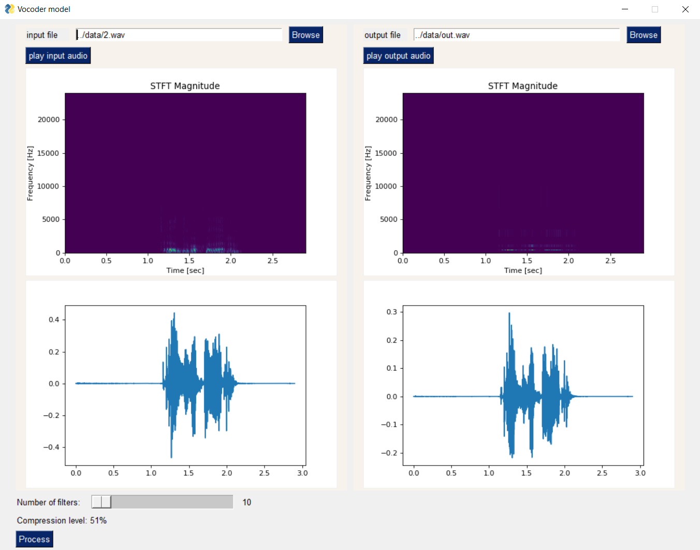

sounddevice Python library depends on PortAudio library

install PortAudio for linux with:

`sudo apt-get install libportaudio2`

in case of error: "No matching distribution found for tkinter"

`sudo apt-get install python3-tk`

install requirements with:

`pip install -r requirements.txt`

